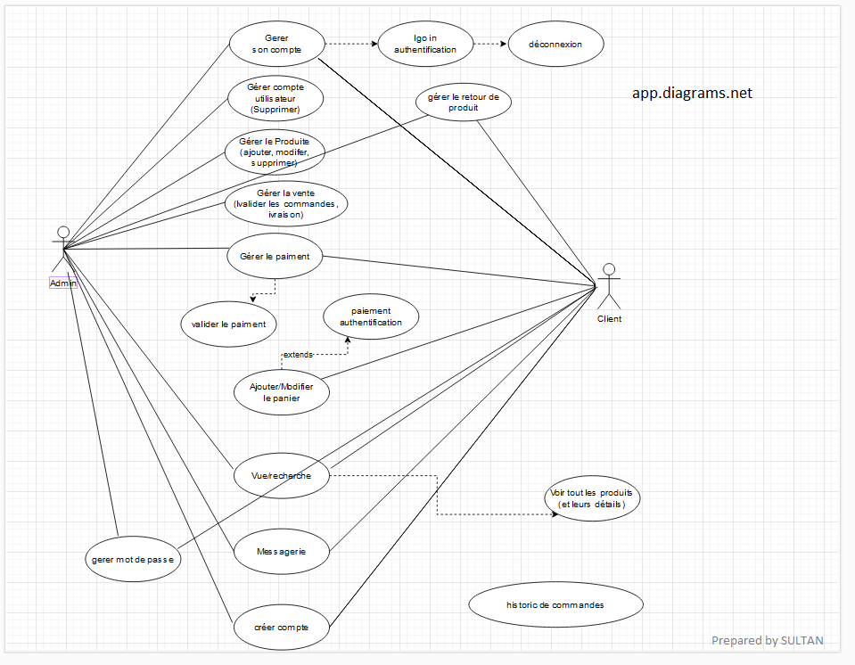
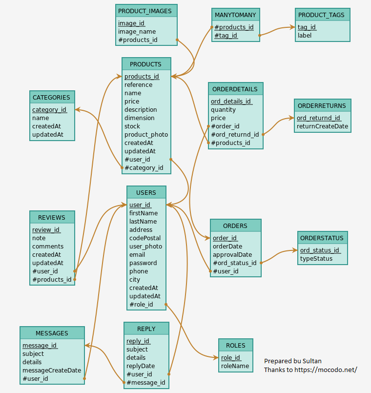
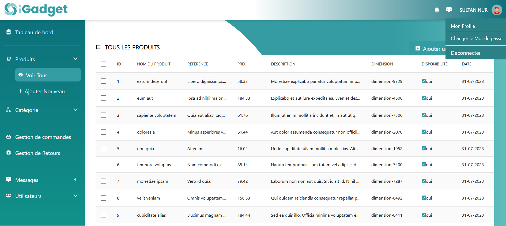
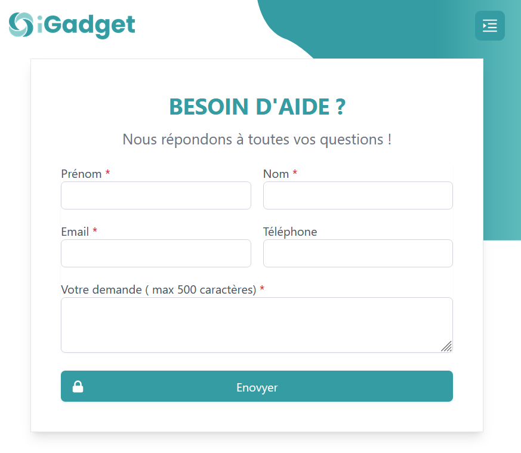

# Projet Ecommerce : iGadget (Backend)
Il s’agit de créer une application classique type E-Commerce, avec des listes de
produits, détails produit, gestion de panier et validation de celui-ci. Avec
également une gestion simple du compte utilisateur.

# Outils utilisée (Backend):
Symfony 6, Composer, JWT, Data Fixtures, Faker Php, Mailer, Mocodo (MCD, MLD)

# Caractéristique :
Le projet est séparé en deux :
• Le BackEnd sera généré avec une des technologies suivante :
o Php : symfony 5.4 (php 7.2.5 ou 8.0), composer
• Le FrontEnd sera réalisé en React. Avec les librairies Formik, Yup, Axios au
minimum. D’autres pourront être ajouté si besoin.

# Besoin :
• Page d’accueil avec la Liste produits.
o Optionnel : filtre selon le type de produit
• Page Détails d’un produit :
o Ajouter le produit dans le panier (avec choix de quantité)
• Page Panier :
o Modifier panier :
▪ Modification quantité
▪ Suppression produit
o Valider panier
o Optionnel : simuler un paiement bancaire
• Gestion de Compte :
o Connexion
o Optionnel : Création de compte
o Optionnel : Modification de compte

## Screenshots

